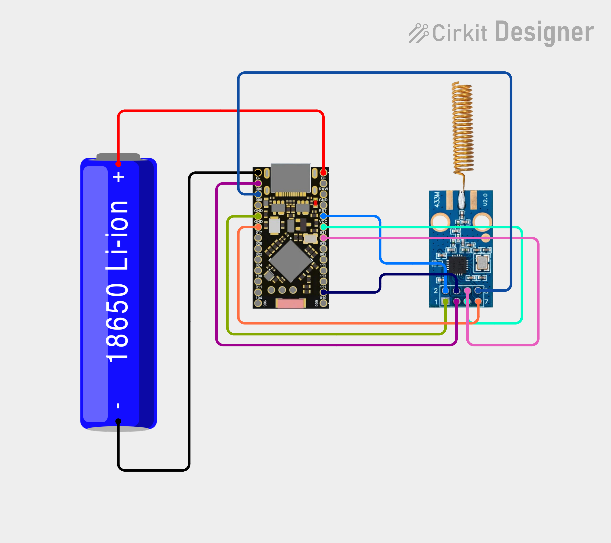

# TPMS Emulator / Sniffer для ProMicro nRF52840 V1940

Порт проекта [TPMS-Emulator](https://git.evgeniys.keenetic.pro/ai_agent/TPMS-Emulator) на платы **ProMicro nRF52840 V1940** (клон Nice!Nano).

Вместо WiFi/Web-интерфейса используется **Bluetooth LE + Android-приложение**.

## Возможности

- Эмуляция 4 TPMS-датчиков PMV-107J (315 / 433 МГц)
- Сниффер реальных датчиков PMV-107J
- Управление через Android-приложение по Bluetooth
- Сохранение настроек во внутренней Flash
- Индикация состояния светодиодом
- Контроль напряжения батареи через внутренний канал **SAADC VDDH/5** (делитель на плате не распаян)
- Детект USB-питания (регистр `USBREGSTATUS`) — приложение показывает «USB» вместо напряжения АКБ
- Android-приложение: вкладки «Главная»/«Настройки», иконка заряда с процентом, расчёт ресурса АКБ

## Схема подключения CC1101

Интерактивная схема: [CirKit Designer](https://app.cirkitdesigner.com/project/575cfbdc-09af-448e-aea8-c7e6fbed4fae)



| Сигнал | Feather D | nRF52840 GPIO | **Метка на плате** |
|--------|-----------|---------------|---------------------|
| MISO   | D29       | P0.17         | **017**             |
| MOSI   | D20       | P0.29         | **029**             |
| SCK    | D21       | P0.31         | **031**             |
| CSN    | D2        | P0.10         | **010**             |
| GDO0   | D11       | P0.06         | **006**             |
| GDO2   | D12       | P0.08         | **008**             |
| POWER  | D28       | P0.20         | **020**             |
| LED    | D24       | P0.15         | (onboard)           |

> **Батарея:** на этой плате делитель батареи не распаян («Voltage divider is unpopulated»,
> см. [nrfmicro wiki](https://github.com/joric/nrfmicro/wiki/Alternatives#supermini-nrf52840)).
> Поэтому напряжение читается внутренним каналом SAADC **VDDH/5** (`batt_pin=255`, по умолчанию).
> Для редких плат с распаянным делителем можно указать пин A0–A7 (`battpin 14..21`).

> **Важно:** Feather-вариант определяет только D0–D34. Не используйте P1.xx пины (кроме D3=P1.15, D7=P1.02) — выход за границы массива сломает BLE.

Подробная инструкция по пайке: [CC1101_WIRING.md](CC1101_WIRING.md)

## Сборка прошивки

Требуется PlatformIO (CLI или VS Code плагин).

```bash
cd android/../..   # корень TPMS-NRF52840
pio run
```

## Прошивка через UF2

1. Дважды нажмите **RESET** на плате — появится USB-диск (обычно `E:` с меткой `NICENANO`).
2. Скопируйте `firmware.uf2` на этот диск.
3. Плата перезагрузится и запустится.

Для конвертации `.hex` в `.uf2`:

```bash
py uf2conv.py -c -f NRF52840 -o firmware.uf2 .pio/build/promicro_nrf52840/firmware.hex
```

## Android-приложение

Приложение находится в папке `android/`. Сборка через Android Studio или Gradle:

```bash
cd android
./gradlew assembleDebug
```

APK будет в `android/app/build/outputs/apk/debug/app-debug.apk`.

### Разрешения

Приложение запрашивает:
- Bluetooth Scan / Connect (Android 12+)
- Location (для сканирования на Android 11 и ниже)

### Использование

1. Включите Bluetooth на телефоне.
2. Откройте приложение — оно само подключится к запомненному устройству **TPMS-NRF52840** или найдёт его.
3. **Главная** — статус подключения и иконка батареи с процентом внутри; ниже — редактор 4 датчиков (ID, давление, температура, TX).
4. **Настройки** — эмулятор (интервал/пакетов), сниффер, частота, батарея (пин/калибровка), расчёт ресурса АКБ, лицензия, лог.

Статус опрашивается каждые 4 с. Поля ввода не перезаписываются, пока вы их редактируете.

## BLE-протокол

Используется стандартный сервис **Nordic UART Service (NUS)**:

- Service UUID: `6e400001-b5a3-f393-e0a9-e50e24dcca9e`
- RX (phone → device): `6e400002-b5a3-f393-e0a9-e50e24dcca9e`
- TX (device → phone): `6e400003-b5a3-f393-e0a9-e50e24dcca9e`

Все команды и ответы — JSON, каждое сообщение заканчивается `\n`.

### Команды

| Команда | Пример | Описание |
|---------|--------|----------|
| status | `{"cmd":"status"}` | Получить полный статус |
| burst | `{"cmd":"burst"}` | Отправить burst всем включённым датчикам |
| tx | `{"cmd":"tx"}` | Включить авто-передачу |
| stop | `{"cmd":"stop"}` | Выключить авто-передачу |
| sensor | `{"cmd":"sensor","sensor":0,"id":"02C03839","pressure":230,"temp":20,"enabled":true}` | Сохранить датчик |
| tx1..tx4 | `{"cmd":"tx1"}` | Отправить один датчик |
| autotx | `{"cmd":"autotx","enabled":true,"interval":300,"packets":2}` | Настроить авто-передачу |
| settings | `{"cmd":"settings","freq":315}` | Сменить частоту |
| sniff_start | `{"cmd":"sniff_start"}` | Запустить сниффер |
| sniff_stop | `{"cmd":"sniff_stop"}` | Остановить сниффер |
| sniff_apply | `{"cmd":"sniff_apply"}` | Применить найденные датчики |
| license | `{"cmd":"license","key":"A1B2C3D4"}` | Активировать лицензию |
| reset | `{"cmd":"reset"}` | Сбросить настройки |
| battpin | `{"cmd":"battpin","pin":255}` | Источник батареи: 255=VDDH (внутр.) или 14..21 (A0..A7) |
| battcal | `{"cmd":"battcal","mv":3540}` | Калибровка: указать реальное напряжение АКБ в мВ |

### Ответы

```json
{"t":"status","data":{"freq":315,"drate":10000,"dev":380,"pwr":7,"tx_en":1,"tx_int":360,"tx_pkt":2,"batt_mv":3730,"batt_pct":60,"batt_raw":213,"batt_pin":255,"batt_cal":0,"license":0,"sniff":0,"usb":0,"sensors":[...],"disc":[...]}}
{"t":"log","m":"[AUTO-TX] Burst done"}
```

Поля батареи: `batt_mv` (мВ, 0 при USB-питании), `batt_pct`, `batt_raw` (сырой ADC), `batt_pin` (255=VDDH), `batt_cal` (мВ калибровки), `usb` (1 — питание от USB, АКБ не измеряется).

## История проб и ошибок

Ключевые уроки, вынесенные в процессе разработки:

1. **BLE UART: команды не парсились, ответы обрывались.**
   Без завершающего `\n` команды терялись, а длинный JSON-status резался по MTU. Решение: добавлять `\n`, буферизовать RX до новой строки, запрашивать больший MTU и писать 20-байтовыми чанками (максимум NUS по умолчанию). Иначе длинный статус (700+ байт) приходил битым.

2. **Распиновка CC1101 для ProMicro V1940.**
   Feather-вариант определяет только D0–D34, реальные пины платы — P0.x. Ошибочная распиновка = «радио не работает». Итог: MISO=D29(P0.17), MOSI=D20(P0.29), SCK=D21(P0.31), CSN=D2(P0.10), GDO0=D11(P0.06), GDO2=D12(P0.08), POWER=D28(P0.20).

3. **DM-кодирование не совпадало с эталонным TPMS-Emulator.**
   Формат «16 нулей + `111110` + DM(1+66+1 бит) + 6 нулей» подогнан под рабочий проект — после этого rtl_433 стал декодировать PMV-107J.

4. **Конфигурация терялась, BLE отваливался при сохранении.**
   LittleFS не подошёл (страница попадала в регион бутлоадера). Перешли на прямое `flash_nrf5x_write` с обязательным `flush()` (без flush данные реально не записывались), страницу конфига перенесли с 255 на 200.

5. **Батарея читалась с мусором.**
   Делитель батареи на плате не распаян, показания пинов случайные. Решение — внутренний канал SAADC **VDDH/5** (`analogReadVDDHDIV5()`, `batt_pin=255`), калибровка командой `battcal`.

6. **USB vs АКБ.**
   При USB-питании VDDH подтягивается к шине USB (~4.2 В) и выглядит как «заряженная батарея» (порог по напряжению не срабатывал). Отличаем по регистру `NRF_POWER->USBREGSTATUS` (VBUSDETECT): поле `usb:1`, `batt_mv=0`.

7. **Android: поля перезаписывались при опросе.**
   Статус опрашивается каждые 4 с и перезаписывал поля ввода, пока пользователь печатал (интервал нельзя было изменить). Добавлена проверка `hasFocus()`.

8. **Расчёт ресурса АКБ «почти не зависит от интервала».**
   Это физика, а не баг: базовое потребление (BLE-анонс ~1 мА + CC1101 в IDLE ~1.5 мА) полностью доминирует над передачами, поэтому интервал 360с vs 3600с меняет ресурс на доли процента (~14 сут на 850 мАч в обоих случаях). Чтобы интервал реально влиял, нужно отключать CC1101 и уходить в сон между передачами — в планах.

### Известные ограничения

- Авто-сон не используется: устройство анонсируется непрерывно.
- CC1101 остаётся в IDLE между передачами (съедает ~1.5 мА) — `cc1101PowerOff()` написан, но не вызывается.

## Лицензия

MIT
